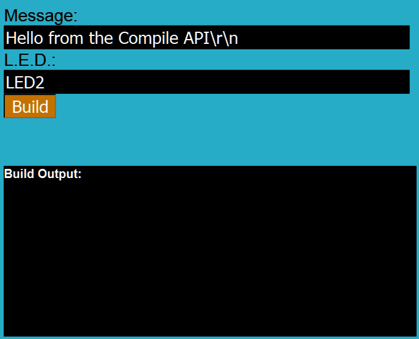

# mbed-compile-api-js dac-demo branch

## What is this?
This code is a modification of the master branch made to work to compile ble beacons. The example-web.html page is meant to run on a table. The webpage takes in the persons name and then compiles the code remotely, the code is then downloaded to the tablet and flashed to the target device over FOTA using the BLE DFU service. 

## What it looks like

## How to use
1. replace the `username` and `password` fields with valid mbed credentials. 
2. import the [ble-scanner-beacon-demo](https://developer.mbed.org/users/mbedAustin/code/ble-scanner-demo-beacon/) code to your mbed account
3. run the example webpage.

Alternatively you can use the `buildRepo` functionality instead, which will not require you to import the code to your workspace. This will however take longer to compile (2-3 min) as compared to the workspace based `buildProgram` method (10-30sec).

4. Change the target, in this example we assume you are using a nordic nRF51822 board and are building a OTA binary for it. Other BLE boards are also supported. 

## Other 
This code is meant to be run on a tablet with BLE. This webpage is one part of a 2 part demo, the other part of the demo runs on a Raspberry Pi 3 and displays who is near the booth. The code for the other half of the demo can be found [here](https://github.com/BlackstoneEngineering/ble-scanner-station-demo)

## Liscense 
Apache 2.0, as always
